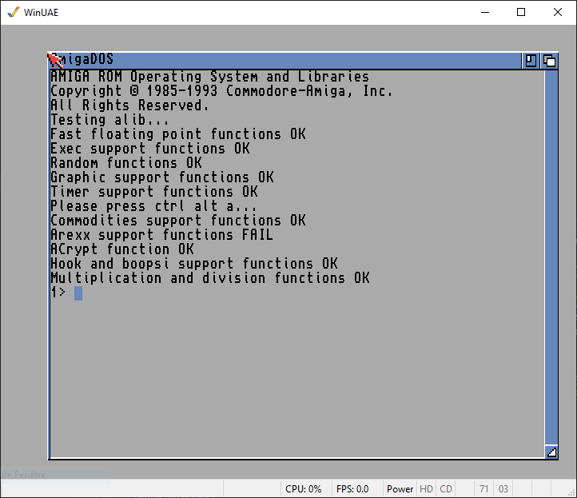

# Static alib library for Classic Amiga (Workbench 3.1)

alib is an ELF library providing the same functions as the original amiga.lib library (but without the stubs) for Classic Amiga.

## Features
alib includes the below fonctions:
- Exec support functions: BeginIO, CreateExtIO, CreatePort, CreateStdIO, CreateTask, DeleteExtIO, DeletePort, DeleteStdIO, DeleteTask, NewList, LibAllocPooled, LibCreatePool, LibDeletePool, LibFreePooled
- Random functions: FastRand, RangeRand
- Graphic support functions: AddTOF, RemTOF, waitbeam
- Math support functions: afp, arnd, dbf, fpa, fpbcd
- Timer support functions: TimeDelay, DoTimer
- Commodities functions: ArgArrayDone, ArgArrayInit, ArgInt, ArgString, HotKey, InvertString, FreeIEvents
- ARexx support functions: CheckRexxMsg, GetRexxVar, SetRexxVar
- Intuition hook and boopsi support functions: CallHookA, CallHook, DoMethodA, DoMethod, DoSuperMethodA, DoSuperMethod, CoerceMethodA, CoerceMethod, HookEntry, SetSuperAttrs
- ACrypt

You'll find more details about these functions in [amigadev.elowar.com](http://amigadev.elowar.com/read/ADCD_2.1/Libraries_Manual_guide/node04AF.html).

Please note that ARexx functions GetRexxVar and SetRexxVar are not yet working in the current version of the library.

## How to create the library
- Install [_amiga-debug_ Visual Studio Code Extension (fork with libraries support)](https://marketplace.visualstudio.com/items?itemName=JOB.amiga-debug-job)
- Choose the menu "File->Open Folder..." and select the directory of this github repository
- Open `.vscode/launch.json` and make `"kickstart"` point to your *Kickstart 3.1* ROM and `"workbench"` to your *Workbench 3.1* floppy (.adf)
- Hit <kbd>F5</kbd> to build and run unit testing (you should get the same screen as above)
- Run the script `ar_alib.txt` (in a UNIX-like environment) from the obj directory to create the archive

## How to use the library
`libalib.a` is included in this repository. In order to link your program with it (using `-lalib`), you will have to declare and open the following libraries: Exec, intuition.library, dos.library, utility.library, graphics.library, commodities.library and icon.library.
Also please note that if you use the option `"-fwhole-program"` in your `Makefile`, you'll have to mark all the libraries as `externally_visible`:\
\_\_attribute\_\_((externally_visible)) struct ExecBase *SysBase;\
\_\_attribute\_\_((externally_visible)) struct IntuitionBase *IntuitionBase;\
\_\_attribute\_\_((externally_visible)) struct DosLibrary *DOSBase;\
\_\_attribute\_\_((externally_visible))struct UtilityBase *UtilityBase;\
\_\_attribute\_\_((externally_visible)) struct GfxBase *GfxBase;\
\_\_attribute\_\_((externally_visible)) struct Library *CxBase;\
\_\_attribute\_\_((externally_visible)) struct Library *IconBase;

If you decide to use the ARexx support functions (only CheckRexxMsg is currently working), you will have to call `__ctor_rexxvars_init()` before and `__dtor_rexxvars_exit()` at the end for clean up, e.g.:\
#include <stdlib_constructor.h>\
\_\_ctor_rexxvars_init();\
...\
CheckRexxMsg(rexxMsg);\
...\
\_\_dtor_rexxvars_exit()

## Credits

- Main code is coming from [clib2](https://github.com/adtools/clib2) written by Olaf Barthel.

- Code for ffp is coming from [MotoFFP](https://github.com/bayerf42/MotoFFP) and [Le_Lisp](https://github.com/GunterMueller/Le_Lisp/).

- Remaining code (additional functions, adaptations, wrappers) by [JOB](https://github.com/jyoberle).

